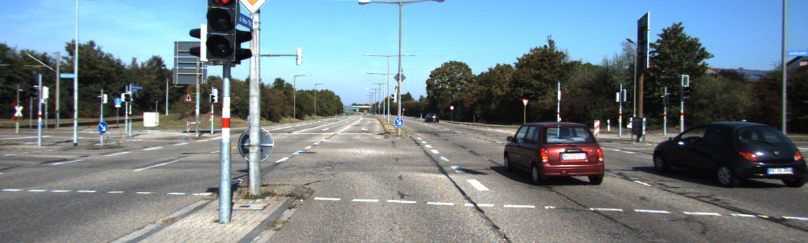
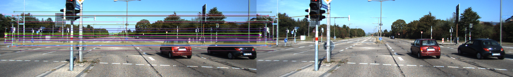
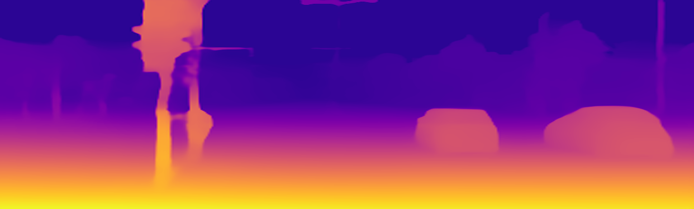
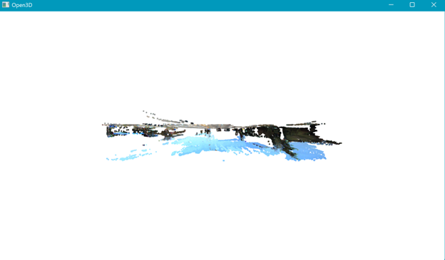
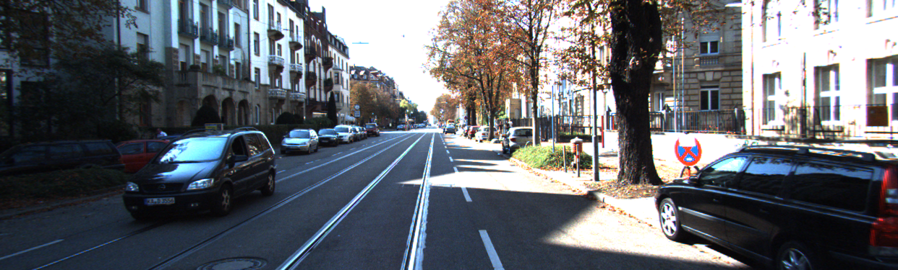
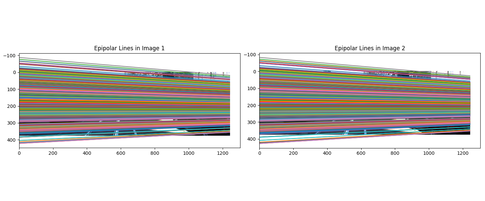
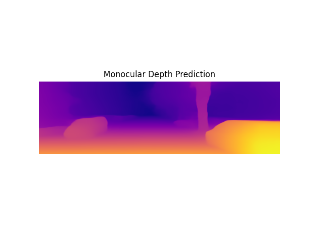
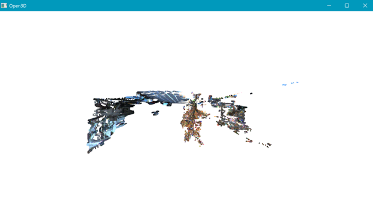

# 3D Reconstruction from Stereo and Monocular Images

This project demonstrates **dense 3D reconstruction** of a scene using both **stereo image pairs** and **monocular depth estimation** techniques.  
It combines traditional computer vision (CV) algorithms with deep learning (MiDaS) to create a comprehensive 3D point cloud of an environment.

## 📸 

| Stereo Image Pair | Matched Features |
|:-----------------:|:----------------:|
|  |  |

| Monocular Depth Map (MiDaS) | 3D Point Cloud |
|:---------------------------:|:-----------------:|
|  |  |


---

## 📂 Directory Structure

```
├── data/
│ └── images/                             # Stereo image samples (KITTI dataset style)
├── results/                              # Output results like matched features, depth maps, etc.
├── src/                                  # Core source code files
│ ├── feature_matching.py                 # SIFT feature detection and matching
│ ├── ransac.py                           # RANSAC for robust Essential matrix estimation
│ ├── lse.py                              # Least Squares Estimation (pose refinement)
│ ├── pose.py                             # Decomposition of Essential Matrix to R, T
│ ├── reconstruct3d.py                    # Triangulation for 3D reconstruction
│ ├── dense_depth.py                      # Dense disparity and depth map computation
│ ├── depth_to_cloud.py                   # Convert dense depth to colored point cloud
│ ├── midas_depth.py                      # Run MiDaS for monocular depth estimation
│ ├── plot_epi.py                         # Plot epipolar lines between stereo pairs
│ └── visualise_pointcloud.py             # Visualize point clouds with Open3D
├── main.py                               # Main pipeline script to run everything
├── requirements.txt                      # Python dependencies
└── .gitignore                            # Git ignore settings

```


---

## 🚀 Project Workflow

1. **Feature Matching (SIFT + FLANN):**  
   - Using SIFT (Scale-Invariant Feature Transform), I detected distinct and scale-invariant keypoints in both stereo images.
   
   - Then, I used the FLANN-based matcher to find reliable correspondences between the two images, even under variations in scale, lighting, or minor perspective changes.
     

2. **Essential Matrix Estimation (RANSAC):**  
   - After obtaining feature matches, I used the RANSAC (Random Sample Consensus) algorithm to robustly estimate the Essential Matrix, which encodes the relative rotation and translation between the two cameras.
   
   - RANSAC helped reject outliers and ensured that only geometrically consistent matches contributed to motion estimation.
   

3. **Pose Recovery (Rotation, Translation):**  
   - I decomposed the Essential Matrix to extract possible rotation (R) and translation (T) matrices between the stereo views.
   
   - Through triangulation consistency checks, the correct pose was selected based on maximizing the number of reconstructed points in front of both cameras.


4. **Sparse 3D Reconstruction (Triangulation):**
   - With the recovered pose, I triangulated the matched feature points to reconstruct a sparse 3D point cloud.
   
   - Each 2D matched keypoint pair was lifted into 3D space based on camera intrinsics and the estimated relative pose.


5. **Dense Depth Map (Stereo Block Matching):**  
   - To go beyond sparse features, I computed dense disparity maps using OpenCV’s Stereo Block Matching technique.
   
   - This allowed generating dense depth maps that estimated depth for almost every pixel in the image pair.

6. **Point Cloud Generation:**  
   - I projected the dense depth maps into 3D world coordinates using known camera intrinsics, producing colored dense 3D point clouds.
   
   - This allowed a full geometric representation of the scene, visualized interactively using Open3D.

7. **Monocular Depth Estimation (MiDaS Model):**  
   - To complement stereo-based depth, I used the MiDaS model (a deep learning-based model trained on multiple datasets) to predict depth from a single image.
   
   - This allowed depth perception even when stereo information might be unavailable or unreliable — important for real-world robotics!

10. **Result Visualization:**  
   - Matched Features
   - Epipolar Lines
   - Depth Map
   - 3D Point Clouds

---

## 📚 Dataset Used

This project utilizes stereo image pairs from the **KITTI 2015 Flow Dataset**, a widely adopted benchmark for optical flow, stereo matching, and 3D scene reconstruction research.

- **Source:** [KITTI 2015 Flow Benchmark](http://www.cvlibs.net/datasets/kitti/eval_scene_flow.php?benchmark=flow)
- **Relevance:**  
  The KITTI dataset provides rectified stereo images with known calibration parameters, making it ideal for stereo depth estimation, epipolar geometry verification, and point cloud reconstruction tasks.
  
Using this dataset ensures the system was tested on realistic, real-world driving scenarios, critical for developing robotics and autonomous navigation solutions.

--- 

## 🛠️ Technologies Used

- **Robotics Engineering Concepts:**
  - Camera Pose Estimation
  - Epipolar Geometry
  - 3D Triangulation
- **Computer Vision:**
  - Feature Matching (SIFT, FLANN)
  - Dense Depth Mapping
  - Point Cloud Visualization (Open3D)
- **Machine Learning / Deep Learning:**
  - MiDaS (Monocular Depth Estimation using Transformers and Convolutions)
- **Libraries:**  
  `OpenCV`, `Open3D`, `NumPy`, `Matplotlib`, `PyTorch`, `timm`
  

---

## 📸 Sample Results

| Stereo Image Pair | Matched Features |
|:-----------------:|:----------------:|
|  |  |

| Monocular Depth Map (MiDaS) | 3D Point Cloud |
|:---------------------------:|:-----------------:|
|  |   |

---


## 📋 How to Run

```bash
# Step 1: Install dependencies
pip install -r requirements.txt

# Step 2: Run the main script
python main.py

```

## 🔮 Future Extensions

Several enhancements can be explored to expand the capabilities of this 3D reconstruction system:

- **Real-Time Dense Reconstruction:**  
  Integrating GPU-accelerated stereo matching or MiDaS inference for real-time 3D scene reconstruction suitable for robotics perception stacks.

- **SLAM Integration:**  
  Extending the current system into a full **Visual SLAM** pipeline by incorporating frame-to-frame pose tracking and global optimization.

- **Sensor Fusion with LiDAR:**  
  Combining stereo vision with LiDAR point clouds for improved depth accuracy, robustness under poor lighting, and outdoor navigation.

- **Surface Reconstruction:**  
  Applying surface meshing algorithms (Poisson Surface Reconstruction, Ball Pivoting) to generate continuous 3D mesh models from point clouds.

- **Semantic Scene Understanding:**  
  Enhancing the point cloud with semantic labels (ground, vehicles, pedestrians) to enable higher-level reasoning for robotics applications.


